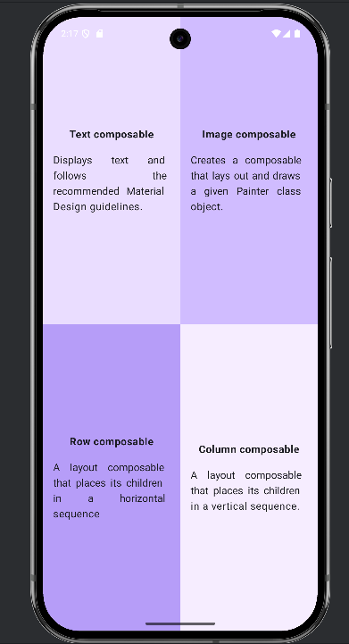

# 🎉 Tarjeta de Cumpleaños - Jetpack Compose

Este proyecto es parte del curso oficial de Android: **"Android Basics with Compose"**.  
La app muestra diferentes cudrantes, en donde varia el color de fondo y el texto de adentro.

---

## 📱 Descripción

La aplicación consiste en:

- Se divide en cuatro areas
- Contiene diferntes colores
- Una firma o remitente personalizado
-

Todo el diseño está hecho usando Jetpack Compose.

---

## 🖼️ Capturas de pantalla

### Ejecución en el emulador:

> Captura tomada desde el emulador Android Studio

---

## 🛠️ Tecnologías utilizadas

- Kotlin
- Jetpack Compose
- Android Studio
- Material Design
- Recursos gráficos (drawables)

---

## 🚀 Cómo ejecutar

1. Cloná el repositorio o descargá el ZIP.
2. Abrí el proyecto en Android Studio.
3. Verificá que tenés configurado un emulador.
4. Ejecutá el proyecto desde `MainActivity.kt`.

---

